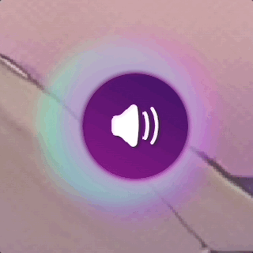

# **A.I.D.A. Dreams User Interface**

This UI displays the processing state and the resulting captions and images from the **A.I.D.A. Dreams** application

## Introduction

The **A.I.D.A. Dreams UI** connects to web socket channels to receive the captions, images and status from the execution of the **A.I.D.A.** project

You can set a custom channel by adding this query parameter "?channel=example" to the url.

```
  http://localhost:3000/?channel=example
```

This are the basic status:

- **Initial**: the app connects to the web socket channel and starts listening for message signals.

  

- **Talking**: it's displayed when **A.I.D.A.** is giving the user instructions

  

- **Listening**: it's displayed when **A.I.D.A.** is receiving user input

  

- **Caption**: a message was received from **A.I.D.A.** in the web-socket/new-caption channel

  

- **Image**: a new image url was received from **A.I.D.A.** in the web-socket/new-url channel

  

  When one or more images have been received the menu becames available with the following options from right to left

  

  - **Reset**: restores the sessions deleting the local stored images and redirects to the initial view
  - **Gallery**: will open the gallery mode where the user can check all images on their local session
  - **Download**: allows to download latest or all images on the session
  - **Email**: allows to send latest or all generated images to the email address in the input value
  - **All images**: toggle checkbox that allows the user to set all images of the session as option for email/download

## Getting Started

To set the communication with the web-sockets with `Pusher` and the email SMTP channel with `Gmail` we need to set our local environment variables.

Create a file `.env.local` in the root of the project with the following contents:

```
  NEXT_PUBLIC_CHANNEL=aida-dream
  NEXT_PUBLIC_URL_EVENT=new-url
  NEXT_PUBLIC_CAPTION_EVENT=new-caption
  NEXT_PUBLIC_CLUSTER=us2
  NEXT_PUBLIC_APP_ID=<APP ID>
  NEXT_PUBLIC_KEY=<PUSHER KEY>
  NEXT_PUBLIC_SECRET=<PUSHER SECRET>
  GMAIL_USER=<GMAIL ACCOUNT ADDRESS>
  GMAIL_PWD=<GMAIL ACCOUNT PASSWORD>
  CC_EMAIL_USERS=<COMMA SEPARATED LIST OF EMAILS TO BE INCLUDED IN EMAIL CC>
```

You need to replace the keys inside the unset `<VALUES>`, for this request this file or the values to a developer on the project.

If this is your first run you need to install the dependencies using:

```bash
  yarn
```

To run local development environment:

```bash
  yarn dev
```

To build and test the production environment:

```bash
  yarn build; yarn start;
```

Open [http://localhost:3000](http://localhost:3000) with your browser to see the initial page.

## Frontend page

You can find the frontend structure of the project on the `pages.tsx` file, all the styles are unified in the `pages.module.scss` at the moment.

The components forming this view are:

- `Initial.tsx` contains the initial elements to be display, the titles and the logo.
- `Start.tsx` displays the welcome screen. This is activated via web-socket by the `/api/load` endpoint with the value `start`.
- `Listening.tsx` starts the listening animation. This is activated via web-socket by the `/api/load` endpoint with the value `listen`.
- `Start.tsx` displays the thank you screen. This is activated via web-socket by the `/api/load` endpoint with the value `end`.
- `Captions.tsx` displays the message pushed by the web-socket event `new-caption`. This is activated by the `/api/caption` endpoint with the message to be displayed as its value.
- `SocketImage.tsx` displays the image pushed by the web-socket event `new-url`. This is activated by the `/api/image` endpoint with the `url` of the image as its value.

## API Endpoints

### POST `/api/load`

Connects to the `web-socket/new-url` channel and toggles the `loading` status

- **Request Headers**:
  `Content-Type: application/json`
- **Request Body Parameters**:
  - `load` (string <start, talk, listen, stop>, required)
  - `channel` (string): name of the socket channel
- Example Request:
  ```
    curl --location 'localhost:3000/api/load' \
    --header 'Content-Type: application/json' \
    --data '{
        "load": true,
        "channel": "test"
    }'
  ```
- **Response**
  The API responds the current status after sending the signal to the web-socket to be published.

  Example response:

  ```
  {
    "data": true,
    "channel": "test"
  }
  ```

- **Response Status**

  - **200: OK** - The loading status was set correctly
  - **500**: Server Error

### POST `/api/image`

Connects to the `web-socket/new-url` channel and publish a new message with the provided image url.

- **Request Headers**:
  `Content-Type: application/json`
- **Request Body Parameters**:
  - `url` (string, required): Url of the image to be displayed
  - `channel` (string): name of the socket channel
- Example Request:
  ```
    curl --location 'localhost:3000/api/image' \
    --header 'Content-Type: application/json' \
    --data '{
        "url": "https://i.imgur.com/Fmdc9sy.jpeg",
        "channel": "test"
    }'
  ```
- **Response**
  The API responds with the status after sending the url to the web-socket to be published.

  Example response:

  ```
  {
    "data": "https://i.imgur.com/Fmdc9sy.jpeg",
    "channel": "test"
  }
  ```

- **Response Status**

  - **200: OK** - The URL was published correctly
  - 422: Unprocessable Entity - The URL value is incorrect and was not published ("Missing URL param" or "Invalid URL value")
  - **500**: Server Error

### POST `/api/caption`

Connects to the `web-socket/new-caption` channel and publish the received message

- **Request Headers**:
  `Content-Type: application/json`
- **Request Body Parameters**:
  - `message` (string): text of the caption to be published, if the value is empty it will hide the caption
  - `channel` (string): name of the socket channel
- Example Request:
  ```
    curl --location 'localhost:3000/api/caption' \
    --header 'Content-Type: application/json' \
    --data '{
        "message": "Caption Example",
        "channel": "test"
    }'
  ```
- **Response**
  The API responds with the message sent to the channel
  ```
  {
    "data": "Caption Example",
    "channel": "test"
  }
  ```
- **Response Status**

  - **200: OK** - The caption was published correctly
  - **500**: Server Error

## Deployment instruction

This app deployment process is set in **AWS Amplify** as `aida-dream-app`

### Continuous Deployment

The deploy process starts automatically when a **PR** is merged in the `main` and `develop` branches, to `production` and `develop` environments

**Github** actions are set not to accept direct pushes to this branches, a **PR** is neccessary to merge.

### Production environment:

https://aida.nacho.software/
